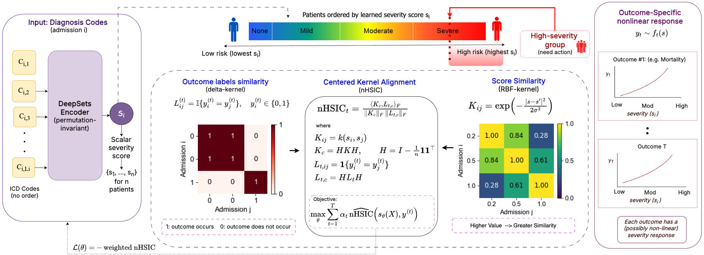
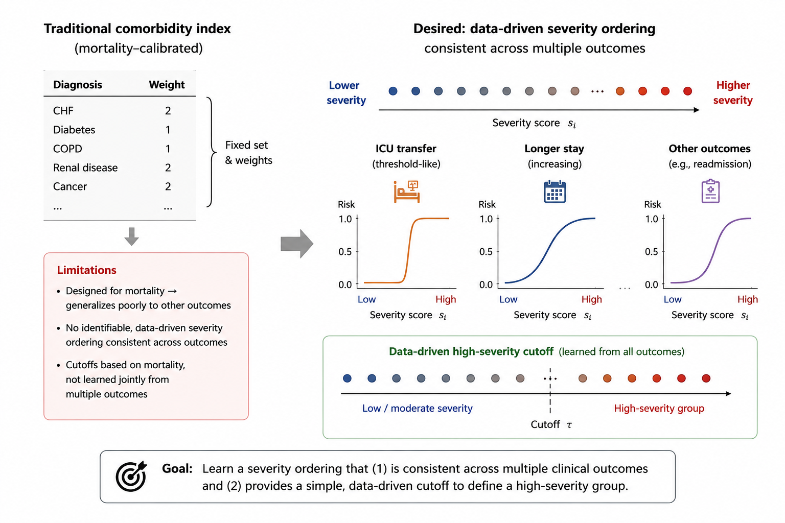

<p align="center">
  
</p>

<p align="center">
  <a href="https://sulemanbashir.vercel.app/">Suleman Baloch</a> ·
  <a href="https://engineering.uiowa.edu/directory/kishlay-jha">Kishlay Jha</a> ·
  <a href="https://cs.uiowa.edu/people/alberto-segre">Alberto Maria Segre</a> ·
  <a href="https://internalmedicine.medicine.uiowa.edu/profile/philip-polgreen">Philip M. Polgreen</a> ·
  <a href="https://homepage.divms.uiowa.edu/~badhikari/">Bijaya Adhikari</a>
</p>

<p align="center">
  
</p>

<p align="center">
  <a href="https://icml.cc/virtual/2026/poster/65590">
    
  </a>
</p>

# A Machine-Learned Comorbidity Index (MLCI)

MLCI maps a variable-length set of diagnosis codes for a hospital admission to a
single scalar severity score. Unlike fixed rule-based indices such as Charlson or
Elixhauser, MLCI learns nonlinear outcome-aware structure directly from electronic
health record data while retaining the simplicity of a one-dimensional clinical
index.

This repository contains the camera-ready code for the MIMIC-III and MIMIC-IV
experiments, including dataset construction, the main MLCI model, classical and
deep-learning baselines, HSIC ablations, rank-one diagnostic experiments, and
risk-curve utilities.

<p align="center">
  
</p>

## Method summary

MLCI is trained in two stages:

1. **Stage 1:** a separate scalar model is trained for each clinical outcome using
   that outcome's labels. Checkpoint selection is explicitly anchored to validation
   in-hospital mortality: every single-task model is evaluated against the same
   mortality reference.
2. **Stage 2:** the mortality-anchored validation nHSIC values are converted into
   stabilized inverse-nHSIC weights. A shared scalar model is then trained using the
   weighted multi-outcome objective.

Mortality anchoring provides a common clinical-severity reference across
heterogeneous outcomes. The learned Stage-2 score is oriented using validation
mortality and evaluated on the test split using nHSIC, distance correlation, and
mutual information. The appendix HSIC ablations use the same explicit Stage-1
mortality anchor.

## Repository structure

```text
A-Machine-Learned-Comorbidity-Index-CameraReady/
├── assets/
├── mimic-iii-experiments/
│   ├── DatasetCreation/
│   │   ├── binaryLabels/
│   │   ├── charlson/
│   │   ├── elixhauser/
│   │   └── createFinalDataSet_mimiciii.py
│   ├── mainPaperExperiments/
│   │   ├── MainModel/
│   │   ├── Baselines/
│   │   └── DiagnosticExperiments/
│   └── appendixExperiments/
│       ├── MainModel/
│       ├── Baselines/
│       └── RiskCurves/
├── mimic-iv-experiments/
│   └── ...                       # parallel MIMIC-IV structure
├── LICENSE.txt
└── README.md
```

The MIMIC datasets are not distributed with this repository. Users must obtain
credentialed access through PhysioNet and provide local paths to the raw data.

## Installation

Python 3.10 was used for the camera-ready experiments. Create an isolated
environment and install the required packages:

```bash
python -m venv .venv
source .venv/bin/activate
python -m pip install --upgrade pip
python -m pip install numpy pandas scipy scikit-learn torch dcor xgboost
```

For GPU experiments, install a PyTorch build compatible with the local CUDA
driver, following the official PyTorch installation instructions. Verify the
installation with:

```bash
python -c "import torch; print(torch.__version__, torch.cuda.is_available())"
```

## Raw-data layout

### MIMIC-IV

`--data_root` must point to the MIMIC-IV directory containing at least the `hosp/`
subdirectory. ICU-transfer label construction additionally requires `icu/`.

```text
<mimic_iv_root>/
├── hosp/
│   ├── admissions.csv.gz
│   ├── diagnoses_icd.csv.gz
│   └── patients.csv.gz
└── icu/
    └── icustays.csv.gz
```

### MIMIC-III

`--data_root` must point to the MIMIC-III directory containing the required raw
tables, including `ADMISSIONS.csv(.gz)`, `PATIENTS.csv(.gz)`,
`DIAGNOSES_ICD.csv(.gz)`, and `ICUSTAYS.csv(.gz)`.

## Dataset creation

Run commands from the corresponding dataset experiment directory. Every label and
clinical-index script requires both `--data_root` and `--out_path`. The output
filenames below are required by the final dataset builders.

### MIMIC-IV

```bash
cd A-Machine-Learned-Comorbidity-Index-CameraReady/mimic-iv-experiments

python DatasetCreation/binaryLabels/create_label_mortality_inhouse_mimiciv.py \
  --data_root /path/to/mimiciv \
  --out_path DatasetCreation/binaryLabels/label_mortality_inhouse_icd10_only.csv

python DatasetCreation/binaryLabels/create_label_mortality_30d_mimiciv.py \
  --data_root /path/to/mimiciv \
  --out_path DatasetCreation/binaryLabels/label_mortality_30d_icd10_only.csv

python DatasetCreation/binaryLabels/create_label_long_stay_mimiciv.py \
  --data_root /path/to/mimiciv \
  --out_path DatasetCreation/binaryLabels/label_long_stay_icd10_only.csv

python DatasetCreation/binaryLabels/create_label_icu_transfer_mimiciv.py \
  --data_root /path/to/mimiciv \
  --out_path DatasetCreation/binaryLabels/label_icu_transfer_icd10_only.csv

python DatasetCreation/charlson/create_charlson_index_mimiciv.py \
  --data_root /path/to/mimiciv \
  --out_path DatasetCreation/charlson/baseline_charlson_mimiciv_icd10.csv

python DatasetCreation/elixhauser/create_elixhauser_index_mimiciv.py \
  --data_root /path/to/mimiciv \
  --out_path DatasetCreation/elixhauser/baseline_elixhauser_vw_mimiciv_icd10.csv

python DatasetCreation/createFinalDataSet_mimiciv.py \
  --data_root DatasetCreation \
  --mimic_root /path/to/mimiciv
```

### MIMIC-III

```bash
cd A-Machine-Learned-Comorbidity-Index-CameraReady/mimic-iii-experiments

python DatasetCreation/binaryLabels/create_label_mortality_inhouse_mimiciii.py \
  --data_root /path/to/mimiciii \
  --out_path DatasetCreation/binaryLabels/label_mortality_inhouse_icd9_only.csv

python DatasetCreation/binaryLabels/create_label_mortality_30d_mimiciii.py \
  --data_root /path/to/mimiciii \
  --out_path DatasetCreation/binaryLabels/label_mortality_30d_icd9_only.csv

python DatasetCreation/binaryLabels/create_label_long_stay_mimiciii.py \
  --data_root /path/to/mimiciii \
  --out_path DatasetCreation/binaryLabels/label_long_stay_icd9_only.csv

python DatasetCreation/binaryLabels/create_label_icu_transfer_mimiciii.py \
  --data_root /path/to/mimiciii \
  --out_path DatasetCreation/binaryLabels/label_icu_transfer_icd9_only.csv

python DatasetCreation/charlson/create_charlson_index_mimiciii.py \
  --data_root /path/to/mimiciii \
  --out_path DatasetCreation/charlson/baseline_charlson_mimiciii_icd9.csv

python DatasetCreation/elixhauser/create_elixhauser_index_mimiciii.py \
  --data_root /path/to/mimiciii \
  --out_path DatasetCreation/elixhauser/baseline_elixhauser_vw_mimiciii_icd9.csv

python DatasetCreation/createFinalDataSet_mimiciii.py \
  --data_root /path/to/mimiciii \
  --dataset_creation_root DatasetCreation
```

Both final builders create:

```text
DatasetCreation/final_datasets/core/
├── admissions_core_train.csv
├── admissions_core_val.csv
├── admissions_core_test.csv
├── diagnoses_icd9_core_train.csv.gz       # MIMIC-III
├── diagnoses_icd9_core_val.csv.gz
├── diagnoses_icd9_core_test.csv.gz
├── diagnoses_icd10_core_train.csv.gz      # MIMIC-IV
├── diagnoses_icd10_core_val.csv.gz
└── diagnoses_icd10_core_test.csv.gz
```

Only the ICD version appropriate to the selected dataset is created.

## Choosing the diagnostic output directory

Set `MLCI_OUTPUT_DIR` to a writable directory of your choice. If it is not set,
MLCI writes to `DiagnosticCSV/` relative to the current working directory:

```bash
export MLCI_OUTPUT_DIR=/path/to/DiagnosticCSV
```

The directory is created automatically. Each run writes a seed-specific file named
`CORE_seed<SEED>_test_scores_and_outcomes.csv`, so runs using different seeds do not
overwrite one another.

## Running MLCI

Run from the corresponding `mimic-*-experiments` directory:

```bash
# MIMIC-IV
SEED=1001 python mainPaperExperiments/MainModel/MLCI_mimiciv.py \
  --data_root DatasetCreation/final_datasets

# MIMIC-III
SEED=1001 python mainPaperExperiments/MainModel/MLCI_mimiciii.py \
  --data_root DatasetCreation/final_datasets
```

The camera-ready stochastic experiments use seeds `11`, `101`, and `1001`:

```bash
for seed in 11 101 1001; do
  SEED="$seed" python mainPaperExperiments/MainModel/MLCI_mimiciv.py \
    --data_root DatasetCreation/final_datasets
done
```

Use `MLCI_mimiciii.py` for MIMIC-III. `EVAL_SEED=12345` is fixed in the scripts for
validation/test subsampling and mutual-information estimation.

## Running baselines

Most model and baseline scripts use the same data-root interface:

```bash
python path/to/script.py --data_root DatasetCreation/final_datasets
```

Examples:

```bash
python mainPaperExperiments/Baselines/Classical_ML_Baselines/lr_mimiciv.py \
  --data_root DatasetCreation/final_datasets

SEED=1001 python \
  mainPaperExperiments/Baselines/Deep_Learning_Baselines/transformers/set_transformer_mimiciv.py \
  --data_root DatasetCreation/final_datasets
```

Baseline families include:

- classical models: logistic regression, k-nearest neighbors, naive Bayes,
  factorization machines, and gradient-boosted trees;
- deep models: Deep MLP, DeepSets pooling variants, MIL attention pooling, Set
  Transformer, StarGAT, DCN, and appendix DeepFM experiments;
- traditional indices: Charlson and Elixhauser/Van Walraven;
- appendix HSIC ablations: DeepSets and Set Transformer variants using single- and
  multi-kernel RBF objectives.

## Diagnostics

MLCI writes a CSV containing `learned_score`, outcome labels, and validity fields.
Pass that file to the dataset-specific rank-one diagnostic script:

```bash
python mainPaperExperiments/DiagnosticExperiments/validate_rank1_nhsic_theory_mimiciv.py \
  --csv /path/to/CORE_seed1001_test_scores_and_outcomes.csv \
  --targets mortality mortality_30d long_stay icu_transfer \
  --order_col learned_score
```

Use `validate_rank1_nhsic_theory_mimiciii.py` for MIMIC-III.

## Risk curves

```bash
python appendixExperiments/RiskCurves/fit_risk_curves.py \
  --csv /path/to/CORE_seed1001_test_scores_and_outcomes.csv \
  --score_col learned_score \
  --targets mortality mortality_30d long_stay icu_transfer \
  --method bins \
  --out curves_bins.csv
```

Supported methods include `bins`, `rolling`, and `isotonic`; consult
`python appendixExperiments/RiskCurves/fit_risk_curves.py --help` for all options.

## Reported metrics

Scripts generally print results to standard output. Reported quantities include:

- normalized HSIC (nHSIC);
- distance correlation;
- mutual information in nats;
- validation binary cross-entropy for applicable prediction baselines.

The raw code reports distance correlation on `[0, 1]` and mutual information in
nats. Apply only the scaling used by the corresponding paper table when formatting
results.

## Reproducibility notes

- Neural experiments use the `SEED` environment variable; the paper uses `11`,
  `101`, and `1001` for stochastic runs.
- Evaluation uses the fixed seed `12345` where indicated in the scripts.
- Dataset splitting is deterministic and patient-level, so admissions from the same
  patient do not cross train, validation, and test splits.
- MLCI Stage-1 training is outcome-specific, while checkpoint selection and weight
  calibration are mortality-anchored.
- GPU floating-point operations and library-version differences may produce small
  numerical differences.

## Troubleshooting

### File-not-found errors

For experiment scripts, `--data_root` should normally point to the directory that
contains `core/`:

```text
/path/to/final_datasets/core/admissions_core_train.csv
```

```bash
python script.py --data_root /path/to/final_datasets
```

Dataset-construction scripts use different arguments; follow the complete commands
in the dataset-creation section above.

### MIMIC files are missing

Raw MIMIC data must be downloaded separately through PhysioNet credentialed access.
This repository does not redistribute protected MIMIC data.

### CUDA is unavailable

```bash
python -c "import torch; print(torch.__version__, torch.cuda.is_available())"
```

CPU execution is supported by most deep-learning scripts but may be slow.

### Numba/dcor cache permissions

On systems where the default Numba cache is not writable, set a writable cache
directory before running scripts that import `dcor`:

```bash
mkdir -p /tmp/mlci_numba_cache
export NUMBA_CACHE_DIR=/tmp/mlci_numba_cache
```

### XGBoost is unavailable

```bash
python -m pip install xgboost
```

## License

This project is licensed under the MIT License. See [LICENSE.txt](LICENSE.txt).
